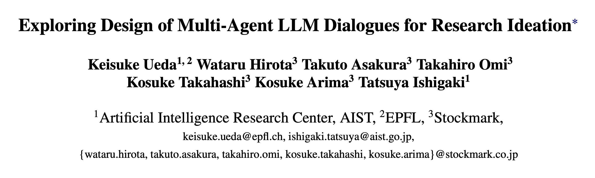
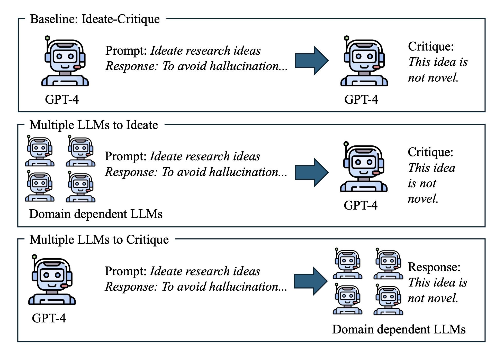

# 🤖 MultiAgent Research Ideator [[Paper (PDF)]](https://arxiv.org/abs/2507.08350)



[](https://2025.sigdial.org/)
[](https://www.python.org/downloads/)
[](https://opensource.org/licenses/MIT)
[](https://arxiv.org/abs/2507.08350)

> **Exploring Design of Multi-Agent LLM Dialogues for Research Ideation**

*Accepted at SIGDIAL 2025* 🎉 — [Read on arXiv](https://arxiv.org/abs/2507.08350) 📄

## 📖 What is This?

How can we design multi-agent LLM systems to generate better research ideas? **MultiAgent Research Ideator** is the research platform behind our SIGDIAL 2025 paper that systematically explores multi-agent dialogue design for research ideation. Through empirical analysis of 7,000 generated ideas, we identify optimal configurations for AI-powered research brainstorming.

Our systematic study investigates three key design dimensions:
- 🤝 **Agent Parallelism**: Multiple simultaneous critics vs. sequential feedback
- 🔄 **Interaction Depth**: Optimal number of critique-revision iterations
- 🔬 **Agent Diversity**: Domain-specific expert personas (Physics-AI, Chemistry-AI, etc.)

<div align="center">

</div>

## 🌟 Research Findings

### Empirical Insights
- **Agent Parallelism**: Increasing the number of critics improves idea diversity but tends to reduce idea quality.
- **Interaction Depth**: Deepening the critique-revision interactions enhances diversity without compromising quality.
- **Critic Diversity**: Introducing diverse critic agents improves idea quality while maintaining diversity.
- **Proposer/Reviewer Diversity**: Increasing diversity among proposers or reviewers boosts idea diversity with little effect on quality.

### Evaluation Protocol
- **7,000 Ideas Generated**: Across 7 AI/NLP research topics with multiple multi-agent configurations.
- **Diversity Measured by Duplicate Filtering**: Based on semantic similarity after duplicate removal.
- **Quality Assessed by GPT-4 Tournament Ranking**: Systematic pairwise comparisons using a zero-shot judge model.

## ⚡ Quick Start

### Prerequisites
```bash
# Install dependencies
uv sync

# Set API keys
export api_key="your_openai_api_key"
export s2_key="your_semantic_scholar_api_key"
export anthropic_key="your_anthropic_key"  # optional
```

### Reproduce Paper Results
```bash
# 1. Literature Review
./scripts/run_lit_review.sh

# 2. Generate Ideas (Multiple Configurations)
./scripts/generate_ideas_and_dedup.sh

# 3. Tournament Evaluation
./scripts/evaluate_ideas.sh
```

### Compare Different Approaches
```bash
# Baseline: Single agent
python multiagent_research_ideator/src/grounded_idea_gen.py \
  --discussion_type "single"

# Our optimal: 3 parallel critics  
python multiagent_research_ideator/src/grounded_idea_gen.py \
  --discussion_type "parallel_self_critique-3"

# Domain expertise injection
python multiagent_research_ideator/src/grounded_idea_gen.py \
  --discussion_type "diff_personas_proposer_reviser"
```


## 🏗️ System Architecture

```
Literature Review → Multi-Agent Ideation → Semantic Deduplication → 
Tournament Ranking → Top Research Proposals
```

### Multi-Agent Configurations
- **`single`**: No critique
- **`baseline`**: Self-critique with single iteration
- **`parallel_self_critique-N`**: N parallel critics provide simultaneous feedback
- **`iterative_self_critique-N`**: N sequential critique-revision rounds
- **`diff_personas_proposer_reviser`**: Domain-specific expert personas for different roles


## 🗂️ Project Structure

```
multiagent_research_ideator/
  src/                     # Core system modules
    lit_review.py       # Literature discovery & scoring
    grounded_idea_gen.py # Multi-agent idea generation
    tournament_ranking.py # Evaluation framework
    ...
  prompts/                # Expert personas & templates
  scripts/               # End-to-end pipelines
  logs/                  # Generated ideas & evaluations
  ```

## 📑 Citation

If you use this work in your research, please cite our SIGDIAL 2025 paper:

```
@inproceedings{ueda2025exploringdesignmultiagentllm,
  title   = {Exploring Design of Multi-Agent LLM Dialogues for Research Ideation},
  author  = {Keisuke Ueda and Wataru Hirota and Takuto Asakura and Takahiro Omi and Kosuke Takahashi and Kosuke Arima and Tatsuya Ishigaki},
  booktitle = {Proceedings of the 26th Annual Meeting of the Special Interest Group on Discourse and Dialogue (SIGDIAL 2025)},
  year   = {2025},
  address  = {Avignon, France},
  note   = {To appear},
  url    = {https://arxiv.org/abs/2507.08350}
}
```

## 📝 Acknowledgements

This project builds upon and extends ideas from the excellent [AI-Researcher](https://github.com/NoviScl/AI-Researcher) project. We gratefully acknowledge their contributions.

## 📝 License

MIT License - feel free to use this for your research and projects!